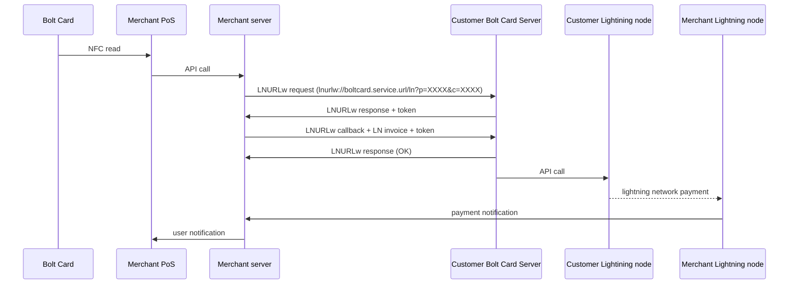

### Sequencing

```mermaid
sequenceDiagram
    participant p1 as Bolt Card
    participant p2 as Merchant PoS
    participant p3 as Merchant server
    participant p4 as Customer Bolt Card Server
    participant p5 as Customer Lightining node
    participant p6 as Merchant Lightning node
    p1->>p2: NFC read
    p2->>p3: API call
    p3->>p4: LNURLw request (lnurlw://boltcard.service.url/ln?p=XXXX&c=XXXX)
    p4->>p3: LNURLw response + token
    p3->>p4: LNURLw callback + LN invoice + token
    p4->>p3: LNURLw response (OK)
    p4->>p5: API call
    p5-->>p6: lightning network payment
    p6->>p3: payment notification
    p3->>p2: user notification
```
