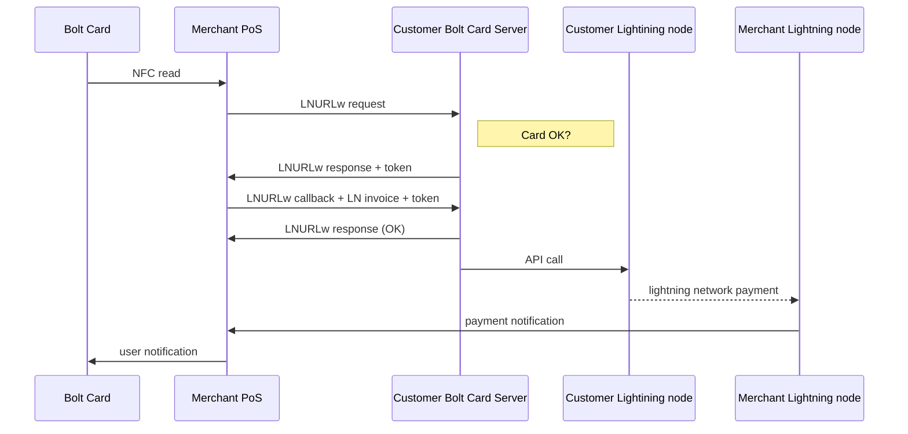

### Sequencing

```mermaid
sequenceDiagram
    participant p1 as Bolt Card
    participant p2 as Merchant PoS
    participant p3 as Customer Bolt Card Server
    participant p4 as Customer Lightining node
    participant p5 as Merchant Lightning node
    p1->>p2: NFC read
    p2->>p3: LNURLw request
    Note right of p3: Card OK?
    p3->>p2: LNURLw response + token
    p2->>p3: LNURLw callback + LN invoice + token
    p3->>p2: LNURLw response (OK)
    p3->>p4: API call
    p4-->>p5: lightning network payment
    p5->>p2: payment notification
    p2->>p1: user notification
```
